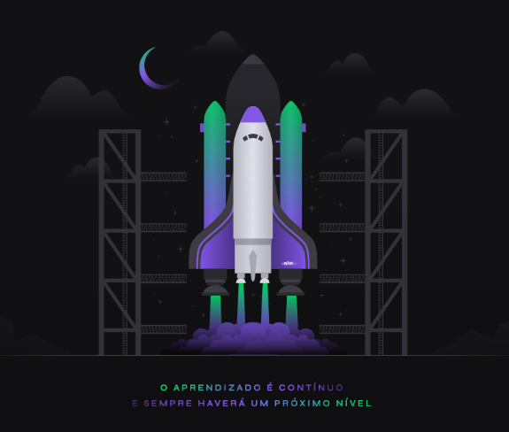

<!-- BADGES -->
<p align="center">
  
  
  
  
  
  <a href="https://www.linkedin.com/in/jvitormf/">
    
  </a>
</p>
<br/>

<!-- PROJECT LOGO -->
<p align="center">
  <a href="https://github.com/jvitormf/nlw4-nodejs">
     
  </a>

  [Next Level Week](http://nextlevelweek.com/) it's a seven-day event created by [Rocketseat](https://rocketseat.com.br/), the objective is to take you to the next level of your career. The event has lots of practice coding, challenges, and networking. An online and completely free event that will help you take the next step. :rocket:
</p>

***

<!-- TABLE OF CONTENTS -->
# Table of Contents
* [About the Project](#boom-about-the-project)
  * [Built With](#gear-built-with)
    * [Tools](#tools)
    * [Technologies](#Technologies)
* [Getting Started](#rocket-getting-started)
  * [Prerequisites](#clipboard-prerequisites)
  * [Installation](#zap-installation)
* [License](#memo-license)
* [Contributing](#bulb-contributing)
* [Contact](#e-mail-contact)
* [Acknowledgements](#exclamation-acknowledgements)
<!-- * [Usage](#usage)
* [Roadmap](#arrows_clockwise-roadmap) -->

<!-- ABOUT THE PROJECT -->
# :boom: About The Project

<!-- Project image -->
<!--  -->


## Description
This API REST is created to be used as a Net Promoter Score (NPS).

# :gear: Built With
  ## Tools
  * [VSCode](https://code.visualstudio.com/)
  * [Insomnia](https://insomnia.rest/download/)
  * [Beekeeper Studio](https://www.beekeeperstudio.io/)

  ## Technologies
  * [Typescript](https://www.typescriptlang.org/)
  * [Node.js](https://nodejs.org/)

  [:arrow_up: Back to top](#table-of-Contents)


<!-- GETTING STARTED -->
# :rocket: Getting Started

To get a local copy up and running follow these simple steps.

[:arrow_up: Back to top](#table-of-Contents)


## :clipboard: Prerequisites

* Node.js - [Install guide](https://nodejs.org/en/download/package-manager/)
* Yarn - [Install guide](https://classic.yarnpkg.com/en/docs/install/#windows-stable)

[:arrow_up: Back to top](#table-of-Contents)


## :zap: Installation
Run the commands below to install and run the app.
  ```sh
    #Clone the project
    git clone https://github.com/jvitormf/nlw4-nodejs
  ```

  ```sh
    #Go to server folder
    cd nlw4-nodejs

    #Install dependencies
    yarn

    #Start the server
    yarn dev:server
   ```

[:arrow_up: Back to top](#table-of-Contents)


<!-- CONTRIBUTING -->
# :bulb: Contributing

Any contributions you make are **greatly appreciated**.

1. Fork the Project
2. Create your Feature Branch (`git checkout -b feature`)
3. Commit your Changes (`git commit -m 'Add some Feature'`)
4. Push to the Branch (`git push origin Feature`)
5. Open a Pull Request

[:arrow_up: Back to top](#table-of-Contents)

<!-- USAGE EXAMPLES -->
<!-- # Usage

Use this space to show useful examples of how a project can be used. Additional screenshots, code examples and demos work well in this space. You may also link to more resources.

_For more examples, please refer to the [Documentation](https://example.com)_ -->


<!-- LICENSE -->
# :memo: License

Distributed under the MIT License. See [LICENSE](LICENSE.md) for more information.

[:arrow_up: Back to top](#table-of-Contents)


<!-- CONTACT -->
# :e-mail: Contact

João Vitor - <j.vitor.mf@gmail.com>

LinkedIn - <https://www.linkedin.com/in/jvitormf/>

[:arrow_up: Back to top](#table-of-Contents)


<!-- ACKNOWLEDGEMENTS -->
# :exclamation: Acknowledgements

* [Next Level Week](http://nextlevelweek.com/)
* [Rocketseat](https://rocketseat.com.br/)

[:arrow_up: Back to top](#table-of-Contents)
